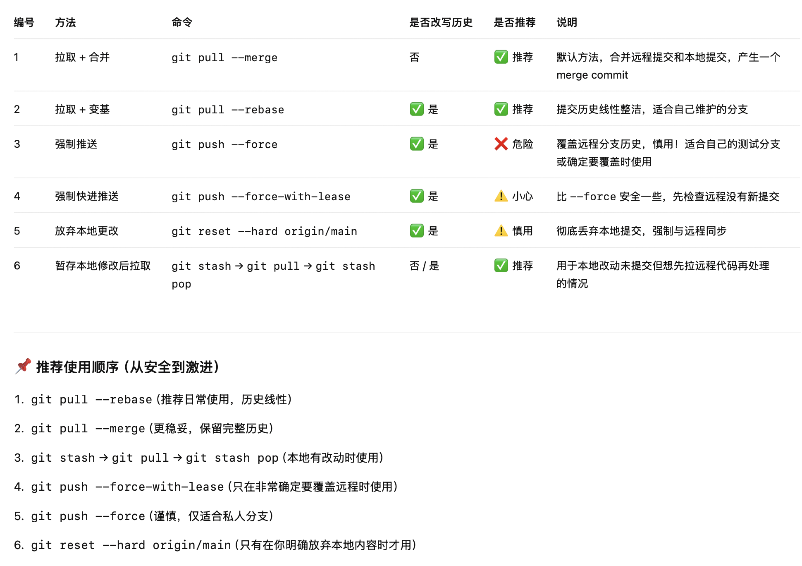
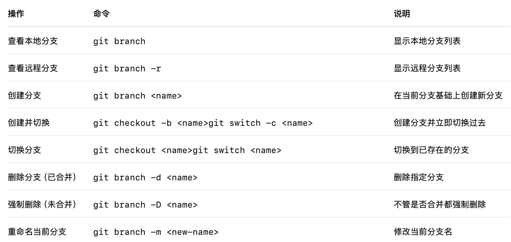
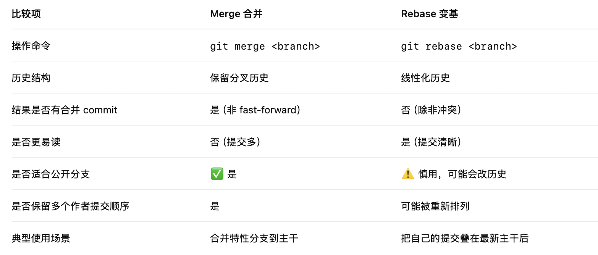
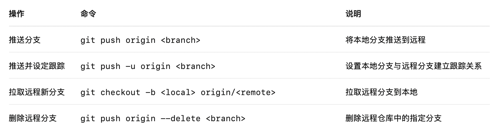
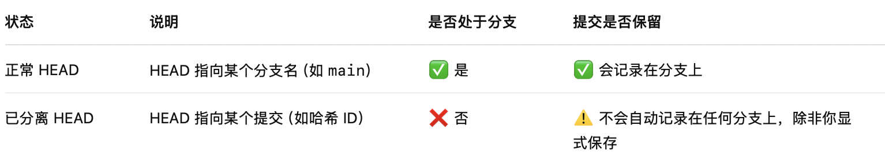
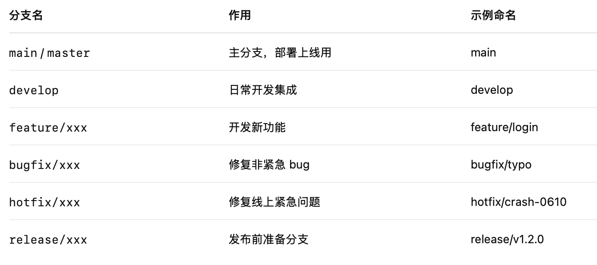

# Git 自学指南

## 2. 撤销操作

### 2.1 文件操作：**git restore**

### 2.2 版本回退：**git reset**

## 3.  合并冲突

## 4. 分支

### 4.1 **分支基本操作命令速查表**

### 4.2 **分支合并与变基对比表**

### 4.3 **远程分支操作表**

### 4.4  **HEAD 与“已分离 HEAD”状态表**

### 4.5 **分支协作流程推荐表（团队）**

